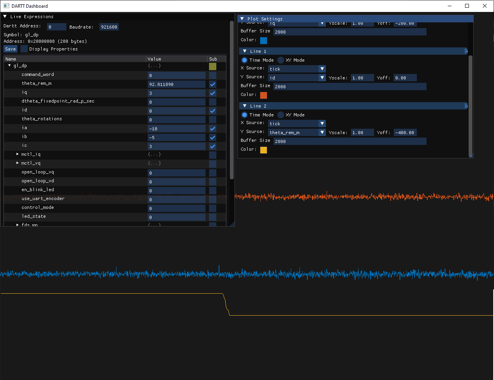

# Dartt Dashboard

## Data visualization for DARTT devices

This software is for visualizing and manipulating data in DARTT devices over serial. 



## Building

If on linux, install SDL2 development libraries with your package manager.

### Debian/Ubuntu
```bash
sudo apt install libgl1-mesa-dev libsdl2-dev
```

### Fedora
```bash
sudo dnf install mesa-libGL-devel SDL2-devel
```

### Arch Linux
```bash
sudo pacman -S mesa sdl2
```

Then compile via cmake:

```bash
git submodule update --init --recursive
mkdir build && cd build
cmake ..
cmake --build .
```

## IMPORTANT NOTE FOR WINDOWS:

You MUST copy the SDL2.dll to the same directory as the compiled executable. It will otherwise fail silently (via cmd) or with an error (if launched via visual studio).

Make sure to use the same target architecture - i.e. [x86](external/SDL/lib/x86/SDL2.dll) or [x64](external/SDL/lib/x64/SDL2.dll). 

