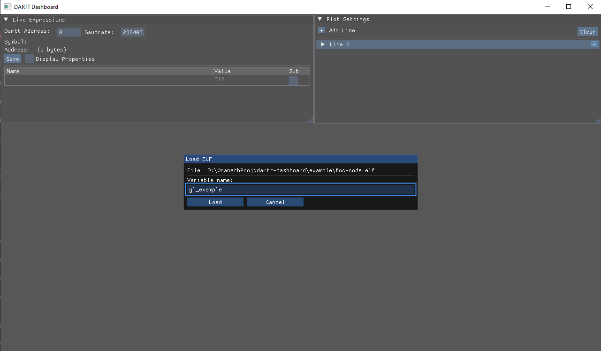
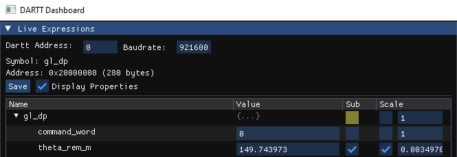

# Usage

## Startup
When launching the software, you will see a blank screen with a Live Expressions and Plot Settings view.

To begin, you can either drag and drop an .elf or a .json file. The .elf must be compiled with DWARF debugging content (on STM32, this can be done with the Debug/ build configuration, with optimize for Debug enabled or similar). 

If using a .json, it must follow the format of the example .json file provided. Alternatively, a .json may be generated using the [dartt-describe](external/dartt-protocol/tools/dartt-describe.py) script, or by loading from .elf and hitting the 'Save' icon in the Live Expressions view.

If dragging and dropping from an .elf, you will be prompted to type the name of the parent symbol mapped to dartt. 

## Live Expressions

The serial address and serial baudrate can be adjusted in the Live Expressions view. To read a value, click the "Subscribe" checkbox on the right hand side. Subscribing to the parent symbol will subscribe to all values. 

The "Display Properties" checkbox allows you to apply a linear gain to your data - this is intented primarily for unit conversions, especially for fixed-point data (for example, a raw ADC value which you want to expose over DARTT without internal unit conversion). The default is 1.

The Live Expressions view works very similarly to live expressions in an embedded IDE, except that it is constrained to only to the DARTT accessible block in your peripheral device. Typing a value in the field will send that value to the device. 

If the display value scale is applied, values typed in that box will be automatically converted based on your display value when writing - for example, if you have a scale of 3.3/4096 applied to an adc value, and you type 1.65, the software will send 2048. If left unchecked, the Display Scale is not used and all units are native. 

The "Save" icon, when pressed, will save a .json file of your data. The path will be displayed in the command prompt/terminal view. It can be drag-and-dropped into the plot view to load that configuration.

### Note on buffer size:

*Important*: your serial DARTT device must have a uart buffer of 32 bytes or more for large reads - `dartt_read_multi` will automatically break large reads into multiple packets based on buffer size, and that is the hardcoded uart buffer size in this software. If you need to adjust the buffer size on the client end (i.e. in a scenario where the dartt peripheral firmware cannot be easily modified) you can modify the client buffer size in [dartt_init.h](../src/dartt_init.h).

## Plotting

The Plotting menu allows you to control real-time visualization of the data in the live expressions view.

#### Line Mode

 There are two plotting modes - "Time Mode", which is like Roll Mode in an oscilloscope, and XY Mode, which is like XY mode in an oscilloscope. The Yscale and Yoffset set the vertical scale and offset (in pixels). When in XY Mode, there is also a horizontal scale and offset. 

 In XY Mode, more memory depth = longer line. The plot data is stored in a buffer that accumulates in size until it reaches Buffer Size, and then becomes circular.

#### Buffer Size

 The Buffer Size controls the memory depth of the values displayed on-screen. In Time Mode, more memory depth = more data displayed in one window. This is the primary way to control horizontal time scaling in Time Mode, although its actual relation to time in seconds depends on sampling speed, which is uncontrolled.  
 
Horizontal scale in Time Mode is controlled by memory depth and is effected by sampling rate - at the time of writing this documentation sampling rate is not controlled. I.e. a read transaction is performed once per render loop, meaning that the true time per division is effected by render speed, the number of packets read from the dartt device, the baud rate, etc. 

Multithreaded reads may be added in future updates to the software, decoupling the read speed from the UI/graphical rendering.

#### Color

The line color can be selected with a Color Wheel.

#### Data Source

The symbol to plot can be selected in the "Y Source" and "X Source" fields. In Time Mode, the X Source should be selected as "sys_sec" (time in seconds since the software began running), unless the Dartt profile has a monotonically increasing time variable (such as a 'tick' or millisecond value, loop iteration, etc.). The actual units of the X Source are irrelevant in Time Mode, since the X axis is automatically scaled to fit the entire window on screen. If swapping units or source variable while data is already on screen, it is recommended to hit the "Clear" button - otherwise you will have to wait until all old data is cleared out of the buffer for the content displayed on screen to be sensible. 

#### New Lines

Lines can be added or removed with the + and - icons in the Plot Settings view. 

#### Saving
All settings are saved in the same .json file. The plot settings are optional and injected as a parameter within the dartt layout/symbol information.
